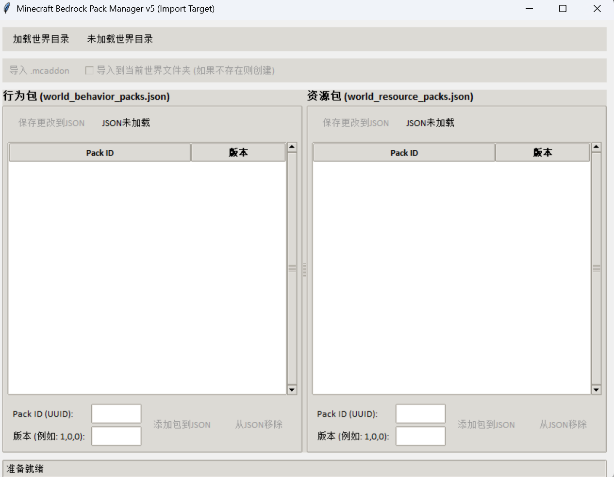

# Minecraft 基岩版世界包管理器 v5 (Import Target)

这是一个基于 Python 和 Tkinter 的桌面工具，用于方便地管理 Minecraft 基岩版世界中的行为包 (behavior packs) 和资源包 (resource packs)。它允许你直接编辑 `world_behavior_packs.json` 和 `world_resource_packs.json` 文件，并提供了从 `.mcaddon` 文件导入包的功能，可以选择导入到服务器级目录或世界级目录。

## 功能特性



* **加载和编辑世界包配置:** 轻松加载和修改指定 Minecraft 世界目录下的 `world_behavior_packs.json` 和 `world_resource_packs.json` 文件。
* **可视化列表:** 清晰地展示世界中已启用的行为包和资源包的 Pack ID (UUID) 和版本。
* **添加/移除包条目:** 通过简单的界面添加或移除 JSON 文件中的包条目。
* **导入 .mcaddon 文件:** 支持解析 `.mcaddon` 文件，自动提取其中的行为包和资源包。
* **灵活的导入目标:**
  * **导入到服务器目录 (默认):** 将包文件复制到服务器根目录下的 `behavior_packs` 和 `resource_packs` 文件夹。
  * **导入到世界目录:** 将包文件复制到当前加载的世界目录下的 `behavior_packs` 和 `resource_packs` 文件夹 (如果不存在则创建)。
* **覆盖提示:** 在导入时，如果目标位置已存在同名包，会弹出提示询问是否覆盖。
* **版本更新提示:** 在将包信息添加到世界 JSON 时，如果发现同 ID 包但版本不同，会询问是否更新世界 JSON 中的版本信息。
* **状态栏提示:** 实时显示当前操作状态和潜在的警告/错误信息。
* **文件保存:** 将对 JSON 文件的修改保存到磁盘。

## 系统要求

* Python 3.6 或更高版本 (通常自带 Tkinter)
* Windows, macOS 或 Linux (只要支持 Tkinter 和 Python 即可)

由于使用了 Python 标准库，理论上无需额外安装库。但如果遇到 `ModuleNotFoundError`，请确保你的 Python 环境包含 Tkinter。

## 如何使用

1. **下载或克隆代码:** 获取 `pack_manager_v5.py` 文件。

2. **运行脚本:** 打开命令行终端或 PowerShell，导航到代码所在的目录，然后运行：
   
   ```bash
   python pack_manager_v5.py
   ```
   
   (如果你将文件保存为其他名字，请替换 `pack_manager_v5.py`)

3. **加载世界目录:**
   
   * 点击界面顶部的 **"加载世界目录"** 按钮。
   * 选择你的 Minecraft 基岩版世界的文件夹路径。
   * 例如：在 Bedrock Dedicated Server 中，世界目录通常在 `worlds` 文件夹内。

4. **管理 JSON 文件:**
   
   * 成功加载世界后，行为包和资源包的列表将显示在界面中。
   * **添加包:** 在 Pack ID (UUID) 和版本输入框中填写信息，然后点击 **"添加包到JSON"**。请确保 Pack ID 是有效的 UUID，版本格式如 `1,0,0`。
   * **移除包:** 在列表中选择一个要移除的包，然后点击 **"从JSON移除"**。
   * **保存更改:** 修改完成后，点击相应区域的 **"保存更改到JSON"** 按钮，将修改写入到 `world_behavior_packs.json` 或 `world_resource_packs.json` 文件。

5. **导入 .mcaddon 文件:**
   
   * 加载世界目录后，**"导入 .mcaddon"** 按钮将可用。
   * **选择导入目标:**
     * **默认 (未勾选复选框):** 导入到推断出的服务器根目录下的 `behavior_packs` 和 `resource_packs` 文件夹。
     * **勾选 "导入到当前世界文件夹":** 导入到当前加载的世界目录下的 `behavior_packs` 和 `resource_packs` 文件夹。
   * 点击 **"导入 .mcaddon"** 按钮。
   * 选择一个 `.mcaddon` 文件。
   * 工具将解压 `.mcaddon`，复制包文件到目标目录，并尝试将包信息（Pack ID 和版本）添加到当前加载世界对应的 JSON 文件中。
   * 导入完成后，请 **务必点击 "保存更改到JSON"** 将导入的包条目保存到世界 JSON 文件中，使其在游戏中生效。

## 注意事项

* **备份你的世界!** 在使用本工具修改世界文件之前，强烈建议备份你的 Minecraft 世界文件夹，以防意外情况发生。
* **UUID 和版本格式:** 请确保输入的 Pack ID 是有效的 UUID 格式，版本格式为逗号分隔的三个数字（例如 `1,0,0`）。
* **导入到世界文件夹:** 选择导入到世界文件夹可能会增加世界文件的大小，并且这些包只在这个特定的世界中可用。通常更推荐导入到服务器级目录以便多个世界共享。
* **服务器结构:** 工具会尝试推断服务器根目录。对于标准的 Bedrock Dedicated Server 结构 (`server_root/worlds/<world_name>`) 应该没有问题。如果你的服务器结构不同，且你想导入到服务器级目录，可能需要手动调整。
* **.mcaddon 文件:** `.mcaddon` 文件实际上是 ZIP 文件，包含行为包和/或资源包的文件夹。工具会解压并识别这些包。

## TODO (未来可能的改进)

* [ ] 提供手动选择服务器根目录的选项
* [ ] 更好的错误处理和用户反馈
* [ ] 打包成可执行文件 (exe) 以便没有 Python 环境的用户使用

## 贡献

欢迎提出建议或贡献代码！
