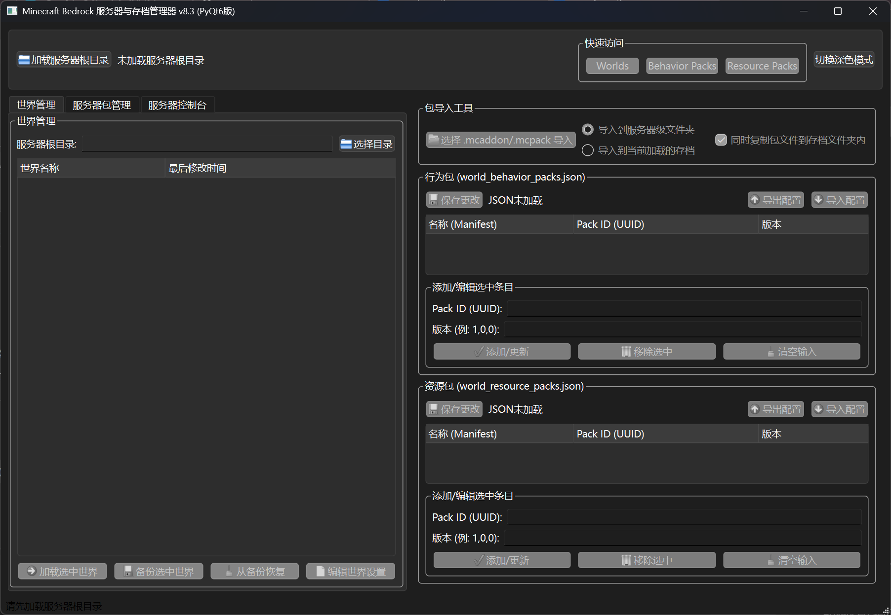

---

# Minecraft Bedrock 服务器与存档管理器 (PyQt6版)

**版本:** v8.3

**作者:** nles-crt(Google AI Studio)

**项目简介:**

这是一个基于 PyQt6 图形界面的 Minecraft 基岩版 (Bedrock Edition) 服务器和存档管理工具。旨在提供一个用户友好的界面，简化服务器目录加载、世界备份与恢复、服务器级和世界级包 (行为包/资源包) 的管理以及服务器控制台操作。

截图:



**主要功能:**

1. **服务器根目录加载:** 轻松选择并加载 Minecraft 基岩版服务器的根目录。
2. **世界管理:**
   * 显示服务器目录下的所有世界列表。
   * 加载并管理特定世界的行为包 (`world_behavior_packs.json`) 和资源包 (`world_resource_packs.json`) 配置。
   * 手动添加、编辑、移除世界包配置条目 (通过 Pack ID 和版本)。
   * 保存对世界包配置 JSON 文件的更改。
   * 导出和导入世界包配置，方便在不同世界之间复制或进行版本控制。
   * 备份选中的世界 (支持文件夹复制和 ZIP 压缩备份，备份文件默认存放在 `world_backups` 文件夹)。
   * 从现有备份中恢复世界。
   * 编辑世界目录下的 `levelname.txt` 等文本配置文件。
3. **服务器包管理:**
   * 显示服务器级 `behavior_packs` 和 `resource_packs` 文件夹中的包列表。
   * 显示包的名称、UUID、版本和修改日期 (从 `manifest.json` 读取)。
   * 支持按名称、UUID、版本和修改时间搜索和排序服务器包列表。
   * 快速将选中的服务器包添加到当前加载世界的世界包配置中。
4. **包导入工具:**
   * 支持导入 `.mcpack` 和 `.mcaddon` 文件。
   * 可以将包导入到服务器级文件夹或当前加载的世界文件夹。
   * 选择导入到世界文件夹时，可选择是否同时复制包文件到世界对应的子文件夹内。
5. **服务器控制台:**
   * 独立的标签页显示服务器的实时日志输出。
   * 启动和停止服务器 (`bedrock_server.exe` 或 `bedrock_server`)。
   * 编辑服务器主配置文件 `server.properties`。
   * 发送命令到运行中的服务器。
6. **快速访问:** 提供按钮快速打开服务器根目录下的 `worlds`、`behavior_packs` 和 `resource_packs` 文件夹。
7. **主题切换:** 支持深色和浅色模式切换。
8. **状态栏:** 提供操作的状态反馈和提示信息。

**环境要求:**

* Python 3.6 或更高版本
* PyQt6 库 (`pip install PyQt6`)
* Minecraft 基岩版服务器文件 (`bedrock_server.exe` 或 `bedrock_server`)

**安装:**

1. 确保你已经安装了 Python 3.6+。

2. 安装 PyQt6 库:
   
   ```bash
   pip install PyQt6
   ```

3. 下载本项目的 `main_qt.py` 文件。

4. 将 `main_qt.py` 文件存放到你喜欢的位置。

**使用方法:**

1. **启动程序:**
   打开命令行或终端，导航到 `main_qt.py` 文件所在的目录，然后运行：
   
   ```bash
   python main_qt.py
   ```
   
   或者，如果你已经将 Python 添加到系统环境变量，直接双击 `main_qt.py` 文件也可能可以直接运行。

2. **加载服务器根目录:**
   点击窗口顶部的“加载服务器根目录”按钮，选择你的 Minecraft 基岩版服务器文件 (`bedrock_server.exe` 或 `bedrock_server`) 所在的文件夹。例如，如果你下载的服务器文件在 `F:\mcbkserver\bedrock-server-1.21.70.03`，就选择这个文件夹。
   加载成功后，顶部的标签会显示选中的目录，并且相关的功能按钮会被启用。

3. **世界管理:**
   
   * 在左侧的“世界管理”标签页，会列出 `worlds` 文件夹下的所有世界。
   * 选中一个世界后，点击“加载选中世界”按钮。右侧的“行为包”和“资源包”部分会加载该世界的包配置。
   * 你可以通过右侧的界面修改世界包配置，并点击“保存更改”保存到 JSON 文件。
   * 选中世界后，可以使用“备份选中世界”进行备份，或使用“从备份恢复”从之前创建的备份中恢复。
   * “编辑世界设置”可以编辑世界目录下的 `levelname.txt` 等文本文件。

4. **服务器包管理:**
   
   * 在左侧的“服务器包管理”标签页，会列出服务器级 Behavior Packs 和 Resource Packs 文件夹中的包。
   * 你可以使用搜索框过滤列表，或使用排序选项重新排列。
   * 选中一个服务器包，如果已加载世界，可以点击“快速添加选中包到世界”将其添加到当前世界的世界包配置中。

5. **包导入工具:**
   
   * 在右侧的“包导入工具”部分，点击“选择 .mcaddon/.mcpack 导入”按钮，选择要导入的包文件。
   * 选择导入目标（服务器级文件夹或当前加载的存档）。
   * 点击“导入”按钮执行导入操作。

6. **服务器控制台:**
   
   * 切换到左侧的“服务器控制台”标签页。
   * 确保已加载服务器根目录后，点击“启动服务器”按钮。服务器日志会显示在日志区域。
   * 在下方的输入框中输入服务器命令（如 `list`, `say Hello`），点击“发送”按钮或按回车键即可发送。
   * 点击“停止服务器”按钮可以尝试关闭服务器。
   * 点击“编辑 server.properties”可以修改服务器的配置文件。

7. **快速访问:**
   点击顶部的“快速访问”区域中的按钮，可以快速打开对应的服务器文件夹。

8. **主题切换:**
   点击顶部的“切换深色模式”/“切换浅色模式”按钮，可以改变应用程序的界面风格。

**注意事项:**

* 在进行世界备份、恢复或修改世界文件时，建议先**停止**服务器，以避免文件被占用或数据损坏。
* 编辑 `server.properties` 或世界配置文件后，可能需要**重启服务器**才能使更改生效。
* 导入 `.mcaddon` 文件时，工具会尝试提取其中包含的包。确保 `.mcaddon` 文件格式正确。
* 如果服务器启动失败报告端口被占用，请按照提示排查并解决端口冲突问题。

**潜在的未来改进 :**

* 集成 NBT 编辑器，以便编辑 `level.dat` 等二进制世界文件。
* 更详细的包依赖检查和冲突检测。
* 用户界面语言本地化。
* 更多服务器配置项的图形化编辑。
* 服务器进程的更精细控制（例如，强制关闭选项）。

**反馈与贡献:**

如果您在使用过程中遇到任何问题，或者有任何改进建议，欢迎通过评论或适当的方式提出。如果您是开发者并希望为本项目贡献代码，也非常欢迎。
